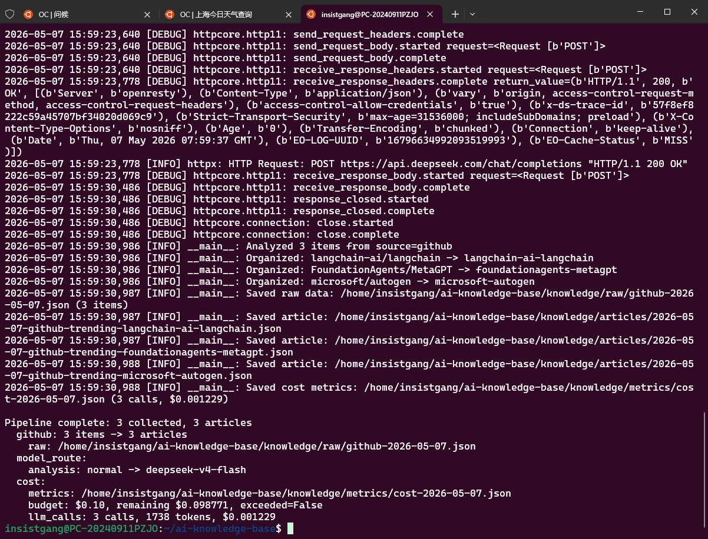
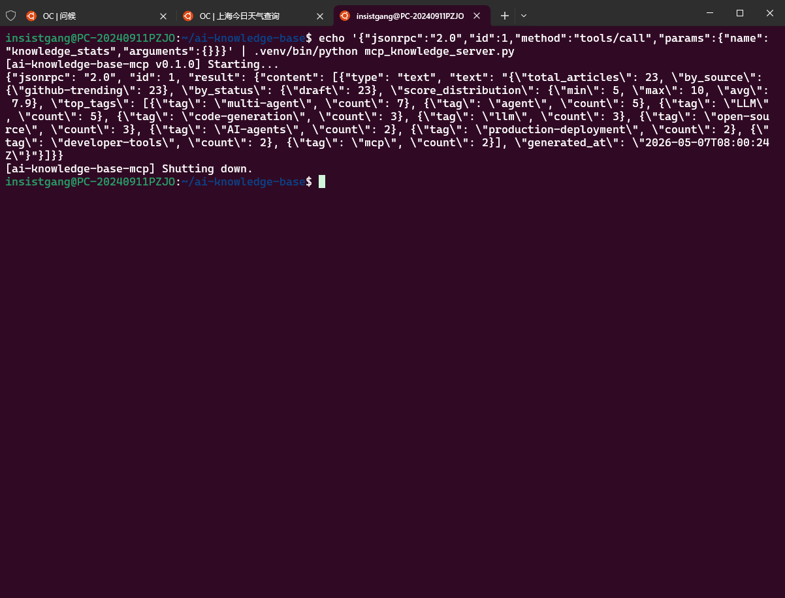
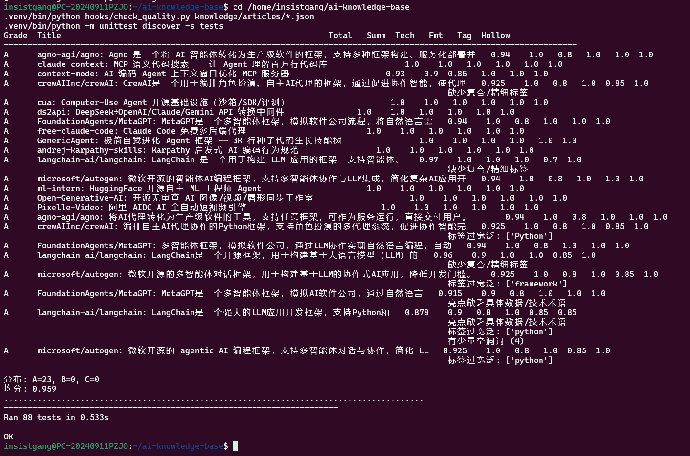

# AI Knowledge Base — 多 Agent 技术知识库助手

自动从 GitHub/HN/arXiv/RSS 采集 AI/LLM/Agent 动态，经 LLM 分析评分、Supervisor 审核、LangGraph 工作流编排后归档为结构化知识条目，支持 MCP 查询与 Dashboard 展示。

## 架构图

```
┌───────────────────────────────────────────────────────────────┐
│                      CLI  /  MCP  /  Dashboard                │
└───────────────────────────┬───────────────────────────────────┘
                            │
┌───────────────────────────▼───────────────────────────────────┐
│                    LangGraph 工作流 (9 节点)                    │
│                                                               │
│   plan ─► collect ─► analyze ─► review ─► organize           │
│                         ▲          │                          │
│                         │    ┌─────┼─────┐                    │
│                         │    │     │     │                    │
│                         │  pass revise human_flag             │
│                         │          │     │                    │
│                         └──────────┘     ▼                    │
│                                        END                   │
│              organize ─► supervise ─► save ─► END            │
└───────────────────────────────────────────────────────────────┘
│
┌───────────────────────────▼───────────────────────────────────┐
│                    Agent Team (5 角色)                         │
│   Router → Collector / Analyzer / Organizer / Supervisor      │
└───────────────────────────────────────────────────────────────┘
│
┌───────────────────────────▼───────────────────────────────────┐
│                        存储层                                  │
│   knowledge/raw/  →  knowledge/articles/  →  MCP Server       │
└───────────────────────────────────────────────────────────────┘
```

## 目录结构

```
ai-knowledge-base/
├── .opencode/agents/           # Agent 角色定义 (5 个)
│   ├── router.md
│   ├── collector.md
│   ├── analyzer.md
│   ├── organizer.md
│   └── supervisor.md
├── .opencode/skills/           # 可复用 Skill
│   ├── github-trending/SKILL.md
│   └── tech-summary/SKILL.md
├── pipeline/                   # 核心流水线代码
│   ├── model_client.py         # 统一 LLM 客户端 (DeepSeek/Qwen/OpenAI)
│   ├── pipeline.py             # 线性流水线入口
│   ├── workflow_state.py       # KBState 状态定义
│   ├── workflow_nodes.py       # 5 节点函数
│   ├── workflow_routes.py      # 条件路由
│   ├── workflow_graph.py       # LangGraph 图构建
│   ├── workflow_runner.py      # run_workflow() 入口
│   └── rss_sources.yaml        # RSS 数据源配置
├── workflows/                  # 高级工作流节点
│   ├── reviewer.py             # LLM 5 维审核评分
│   ├── reviser.py              # Feedback 驱动改写
│   ├── human_flag.py           # 超限兜底人工审核
│   └── planner.py              # 动态策略规划
├── hooks/                      # 质检脚本
│   ├── validate_json.py        # JSON 格式校验
│   └── check_quality.py        # A/B/C 质量评分
├── mcp_knowledge_server.py     # MCP JSON-RPC Server (3 tools)
├── knowledge/                  # 数据存储
│   ├── raw/                    # 原始采集数据
│   ├── articles/               # 标准知识条目
│   └── pending_review/         # 待人工审核
├── specs/                      # 规格与验收文档
│   ├── multi-agent-routing.md
│   ├── v3-multi-agent-acceptance.md
│   └── v4-langgraph-workflow-acceptance.md
├── tests/                      # 测试套件 (88 tests)
│   ├── test_model_client.py
│   ├── test_workflow_state.py
│   ├── test_workflow_nodes.py
│   ├── test_workflow_routes.py
│   ├── test_workflow_graph.py
│   ├── test_workflow_runner.py
│   └── test_multi_agent_contracts.py
├── .github/workflows/          # CI/CD
│   └── daily-collect.yml       # 每日自动采集
├── docs/learning-roadmap.md    # 学习路线图
├── AGENTS.md                   # 项目规范
├── requirements.txt
├── .env.example
└── README.md
```

## 快速开始

```bash
# 1. 克隆并安装依赖
git clone https://github.com/insistgang/ai-knowledge-base.git
cd ai-knowledge-base
python3 -m venv .venv
source .venv/bin/activate
pip install -r requirements.txt

# 2. 配置 API Key
cp .env.example .env
# 编辑 .env，填入 DEEPSEEK_API_KEY 等

# 3. 运行完整流水线
python pipeline/pipeline.py --sources github --limit 5

# 4. LangGraph 工作流
python -c "
from pipeline.workflow_runner import run_workflow
state = run_workflow(sources=['github'], limit=3, dry_run=True)
print(state['review_status'])
"

# 5. MCP 知识库查询
echo '{"jsonrpc":"2.0","id":1,"method":"tools/call","params":{"name":"search_articles","arguments":{"keyword":"agent"}}}' | python mcp_knowledge_server.py

# 6. 质量检查
python hooks/validate_json.py knowledge/articles/*.json
python hooks/check_quality.py knowledge/articles/*.json

# 7. 运行测试
python -m unittest discover -s tests
```

## 核心能力

| 模块 | 功能 |
|------|------|
| `model_client.py` | DeepSeek/Qwen/OpenAI 统一调用，含重试与成本估算 |
| `pipeline.py` | collect→analyze→organize→save 线性流水线 |
| LangGraph 工作流 | 9 节点状态机：plan→collect→review→revise→human_flag |
| Reviewer | 5 维 LLM 评分，加权≥7.0 通过，代码重算不信任模型 |
| MCP Server | JSON-RPC 2.0，3 工具：search/get/stats |
| CI/CD | 每日 8:00 UTC GitHub Actions 自动采集→校验→提交 |

## 技术栈

Python 3.12 · LangGraph · httpx · JSON-RPC 2.0 · MCP · GitHub Actions

## 运行截图

| 管线运行 | MCP 知识库查询 | 测试全量通过 |
|:---:|:---:|:---:|
|  |  |  |

## 许可证

MIT
