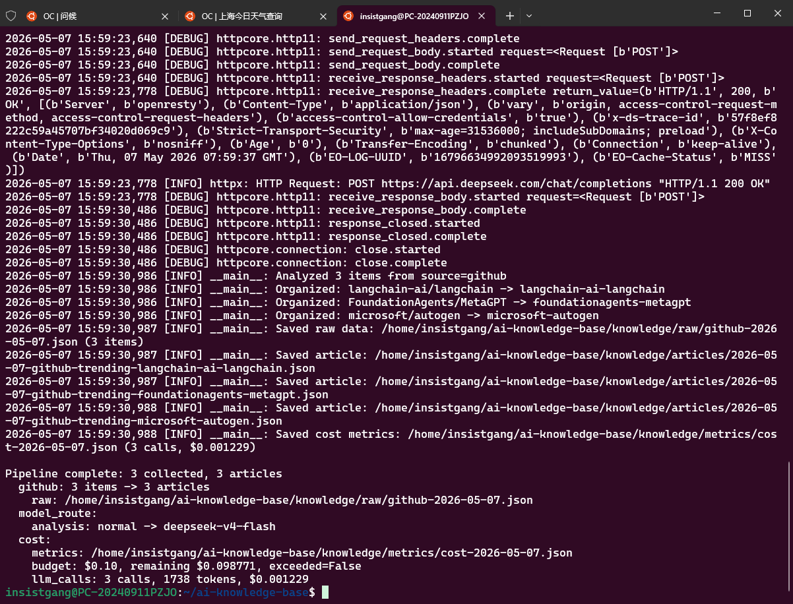
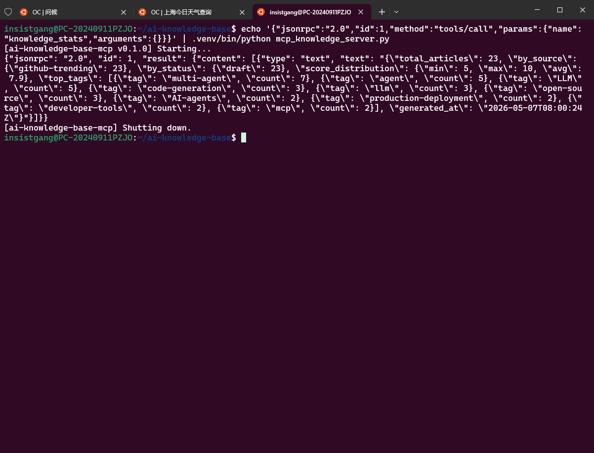
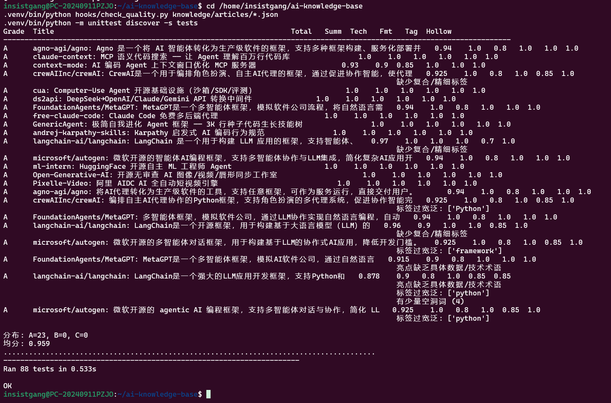
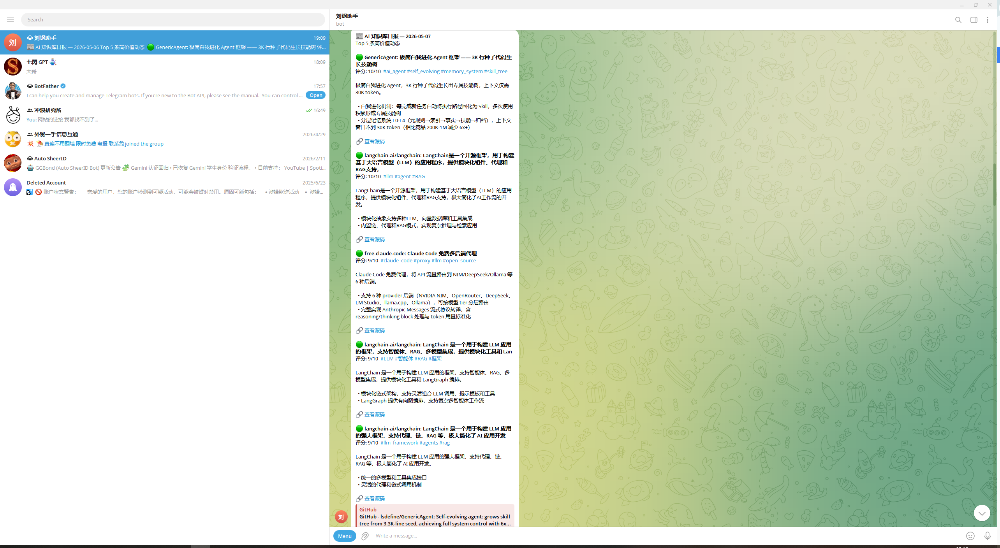
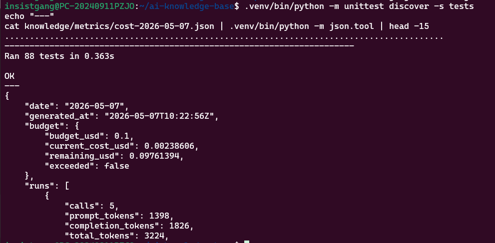

# AI Knowledge Base — 多 Agent 技术知识库助手

> 🎓 **毕业项目** | 基于多 Agent 协作的 AI 技术知识库——自动采集、智能分析、定时推送

**🔗 相关链接**
- **GitHub 仓库**: [https://github.com/insistgang/ai-knowledge-base](https://github.com/insistgang/ai-knowledge-base)
- **可视化知识库**: [https://insistgang.top/ai-knowledge-base/](https://insistgang.top/ai-knowledge-base/)

**📊 毕业设计达标状态**

| 要求 | 状态 | 说明 |
|------|------|------|
| 完整代码 + 目录 | ✅ | 1,000+ 个版本化文件，9 节点 LangGraph + 5 Agent + MCP Server |
| README.md | ✅ | 架构图 + 快速开始 + 截图 |
| 配置文件 | ✅ | .env.example + pytest.ini + requirements.txt |
| 运行截图 3 张 | ✅ | pipeline / MCP / tests |
| Git 历史 | ✅ | 每日采集和功能变更均保留可追溯提交 |

**🎯 项目亮点**
- 🤖 **5 Agent 角色**：Router / Collector / Analyzer / Organizer / Supervisor
- 🔄 **9 节点 LangGraph 工作流**：plan → collect → analyze → review → revise → organize → supervise → save → human_flag
- 📊 **123 个本地测试**：全部通过，付费模型评估默认隔离
- 🔌 **MCP Server**：JSON-RPC 2.0，3 工具（search_articles/get_article/knowledge_stats）
- 📈 **可视化 Dashboard**：GitHub Pages 部署
- 🚀 **V4 产品原型**：Telegram Bot + 知识检索 + Skill 路由

---

当前自动从 GitHub 采集 AI/LLM/Agent 项目，经 LLM 分析评分、Reviewer 修订闭环、Supervisor 规则审核和 LangGraph 编排后归档为结构化知识条目，支持 MCP 查询与 Dashboard 展示。RSS、HN 和 arXiv 属于后续数据源规划。

## 架构图

```
┌───────────────────────────────────────────────────────────────┐
│                      CLI  /  MCP  /  Dashboard                │
└───────────────────────────┬───────────────────────────────────┘
                            │
┌───────────────────────────▼───────────────────────────────────┐
│                    LangGraph 工作流 (9 节点)                    │
│                                                               │
│   plan ─► collect ─► analyze ─► review ─► organize           │
│                         ▲          │                          │
│                         │    ┌─────┼─────┐                    │
│                         │    │     │     │                    │
│                         │  pass revise human_flag             │
│                         │          │     │                    │
│                         └──────────┘     ▼                    │
│                                        END                   │
│              organize ─► supervise ─► save ─► END            │
└───────────────────────────────────────────────────────────────┘
│
┌───────────────────────────▼───────────────────────────────────┐
│                    Agent Team (5 角色)                         │
│   Router → Collector / Analyzer / Organizer / Supervisor      │
└───────────────────────────────────────────────────────────────┘
│
┌───────────────────────────▼───────────────────────────────────┐
│                        存储层                                  │
│   knowledge/raw/  →  knowledge/articles/  →  MCP Server       │
└───────────────────────────────────────────────────────────────┘
```

## 目录结构

```
ai-knowledge-base/
├── .opencode/agents/           # Agent 角色定义 (5 个)
│   ├── router.md
│   ├── collector.md
│   ├── analyzer.md
│   ├── organizer.md
│   └── supervisor.md
├── .opencode/skills/           # 可复用 Skill
│   ├── github-trending/SKILL.md
│   └── tech-summary/SKILL.md
├── pipeline/                   # 核心流水线代码
│   ├── model_client.py         # 统一 LLM 客户端 (DeepSeek/Qwen/OpenAI)
│   ├── article_store.py        # canonical 去重视图
│   ├── pipeline.py             # 采集/分析/存储基础能力
│   ├── workflow_state.py       # KBState 状态定义
│   ├── workflow_nodes.py       # 5 节点函数
│   ├── workflow_routes.py      # 条件路由
│   ├── workflow_graph.py       # LangGraph 图构建
│   ├── workflow_runner.py      # run_workflow() 入口
│   └── rss_sources.yaml        # RSS 数据源配置
├── workflows/                  # 高级工作流节点
│   ├── reviewer.py             # LLM 5 维审核评分
│   ├── reviser.py              # Feedback 驱动改写
│   ├── human_flag.py           # 超限兜底人工审核
│   └── planner.py              # 动态策略规划
├── hooks/                      # 质检脚本
│   ├── validate_json.py        # JSON 格式校验
│   ├── audit_corpus.py         # 跨文件 ID/URL 审计
│   └── check_quality.py        # A/B/C 质量评分
├── mcp_knowledge_server.py     # MCP JSON-RPC Server (3 tools)
├── knowledge/                  # 数据存储
│   ├── raw/                    # 原始采集数据
│   ├── articles/               # 标准知识条目
│   └── pending_review/         # 待人工审核
├── specs/                      # 规格与验收文档
│   ├── multi-agent-routing.md
│   ├── v3-multi-agent-acceptance.md
│   ├── v4-langgraph-workflow-acceptance.md
│   ├── v5-collection-quality-acceptance.md
│   └── v6-production-integrity.md
├── tests/                      # 测试套件 (123 tests)
│   ├── test_model_client.py
│   ├── test_workflow_state.py
│   ├── test_workflow_nodes.py
│   ├── test_workflow_routes.py
│   ├── test_workflow_graph.py
│   ├── test_workflow_runner.py
│   ├── test_multi_agent_contracts.py
│   ├── cost_guard.py           # 成本守卫
│   ├── eval_test.py            # 评估测试
│   └── security.py             # 安全防护
├── .github/workflows/          # CI/CD
│   └── daily-collect.yml       # 每日自动采集
├── docs/learning-roadmap.md    # 学习路线图
├── AGENTS.md                   # 项目规范
├── requirements.txt
├── requirements-dev.txt
├── pytest.ini
├── .env.example
└── README.md
```

## 快速开始

```bash
# 1. 克隆并安装依赖
git clone https://github.com/insistgang/ai-knowledge-base.git
cd ai-knowledge-base
python3 -m venv .venv
source .venv/bin/activate
pip install -r requirements-dev.txt

# 2. 配置 API Key
cp .env.example .env
# 编辑 .env，填入 DEEPSEEK_API_KEY 等

# 3. 运行生产 LangGraph 流水线
python -m pipeline.workflow_runner --sources github --limit 5

# 4. 无文件写入演练
python -m pipeline.workflow_runner --sources github --limit 3 --dry-run

# 5. MCP 知识库查询
echo '{"jsonrpc":"2.0","id":1,"method":"tools/call","params":{"name":"search_articles","arguments":{"keyword":"agent"}}}' | python mcp_knowledge_server.py

# 6. 质量检查
python hooks/validate_json.py knowledge/articles/*.json
python hooks/audit_corpus.py knowledge/articles/*.json --fail-on-duplicate-id
python hooks/check_quality.py knowledge/articles/*.json

# 7. 运行测试
python -m pytest
```

## 数据完整性

- 历史 JSON 文件全部保留，作为可追溯的采集记录。
- MCP 和 Dashboard 按规范化 `source_url` 选择最新记录，默认隐藏历史重复项。
- `audit_corpus.py` 阻止重复 ID 进入生产链路；历史重复 URL 只报告、不删除。
- LLM 审核真实完成并通过后，新条目状态从 `draft` 更新为 `reviewed`；降级放行仍保持 `draft`。

## 核心能力

| 模块 | 功能 |
|------|------|
| `model_client.py` | DeepSeek/Qwen/OpenAI 统一调用，含重试与成本估算 |
| `pipeline.py` | GitHub 采集、LLM 分析、标准化、成本统计等基础能力 |
| LangGraph 工作流 | 生产入口，9 节点状态机：plan→collect→analyze→review→revise→organize→supervise→save/human_flag |
| Reviewer | 5 维 LLM 评分，加权≥7.0 通过，代码重算不信任模型 |
| MCP Server | JSON-RPC 2.0：search_articles/get_article/knowledge_stats |
| CI/CD | 每日 8:00 UTC 运行测试→LangGraph→校验→语料审计→提交 |

## 技术栈

Python 3.12 · LangGraph · httpx · JSON-RPC 2.0 · MCP · GitHub Actions

## 运行截图

| 管线运行 | MCP 知识库查询 | 测试全量通过 |
|:---:|:---:|:---:|
|  |  |  |

| Telegram Bot 日报推送 | 成本统计 |
|:---:|:---:|
|  |  |

## 许可证

MIT
