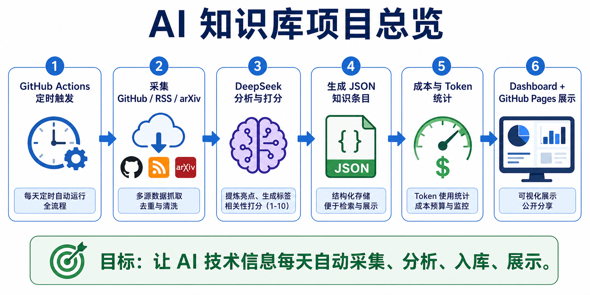

# 01｜我为什么先把环境搭好：研究生做 AI 工程，第一步不是写代码

> 公众号名称：研路炼钢  
> 系列名称：从 0 到 1 搭建 AI 知识库  
> 文章编号：01  
> 配图文件名：images/01-environment-cover.png

## 封面图建议

一张克制的桌面照片：WSL 终端、项目目录树、一本打开的实验记录本和一杯水。画面不要太科技感，重点放在“一个人开始搭建长期工作台”的感觉。

## 开头场景

读研之后，我很快发现一件事：真正拖慢我的，往往不是某个模型不懂，也不是某段代码不会写，而是环境混乱。

一个论文项目、一个竞赛项目、一个课程作业、一个临时脚本，全部堆在同一个目录里。今天为了跑 YOLO 装了一个包，明天为了做可视化又换了 Node 版本，后天打开终端，连自己上次为什么建这个文件夹都忘了。最可怕的是，当我想复现某次实验时，发现当时的命令、依赖、输出位置，全都没有留下清楚的痕迹。

所以“研路炼钢”这个系列的第一篇，我不想从多智能体、LangGraph 或某个炫目的 Agent 功能开始。我想从最朴素的一件事开始：把自己的 AI 知识库项目环境搭起来。

对研究生来说，环境不是装软件这么简单。它更像一个长期工作台。工作台乱，后面的论文阅读、代码实验、模型评测、资料整理都会变成消耗。

## 这节做了什么

我给 `ai-knowledge-base` 建了一个清晰的项目边界。

这个项目的定位很明确：它不是一个临时爬虫，也不是一个随手存链接的文件夹，而是一个个人 AI 技术知识库助手。它负责从 GitHub Trending、Hacker News、arXiv、RSS 等信息源采集 AI、LLM、Agent 相关动态，再经过分析、去重、评分和整理，保存成结构化知识条目。

环境层面，我先做了三件事。

第一，确定项目根目录和职责。所有与这个知识库相关的代码、数据、规格、测试，都放在 `ai-knowledge-base` 下面，不再和论文项目、前端项目、生活管理文档混在一起。

第二，建立基础目录结构。`pipeline` 放采集和处理逻辑，`knowledge/raw` 放原始数据，`knowledge/articles` 放清洗后的知识条目，`specs` 放需求和验收标准，`tests` 放回归测试。这个结构看起来普通，但它解决的是“以后我还能不能找回来”的问题。

第三，写项目规范。`AGENTS.md` 里说明了技术栈、目录职责、质量标准和红线。比如不能编造不存在的项目或 URL，不能把 API Key 写进仓库，AI 生成内容要区分事实、推断和建议。这些规则不是为了显得专业，而是为了防止自己在后面越做越乱。

## 关键产物

这一节最重要的产物，不是某个能跑起来的模型，而是一个能持续生长的项目框架。

我留下了项目入口说明、规范文件、数据目录、流水线目录和测试目录。它们共同回答了几个基础问题：

这个项目要解决什么问题？数据从哪里来？处理后放在哪里？什么算有效输出？以后新增能力应该放在哪？哪些事情不能做？

这些问题如果一开始不回答，后面每加一个功能都会变成临时决定。临时决定多了，系统就会变成补丁堆。

对我来说，环境搭建的价值在于降低后续决策成本。当我以后想加一个 RSS 源，不需要重新思考目录；想加一个成本统计模块，不需要纠结放在哪；想让另一个 Agent 接手，也能先读规范，而不是猜我的习惯。

## 我真正学到的

我以前对“环境”的理解太窄了，以为装好 Python、Node、依赖管理器，就算环境就绪。现在我更愿意把环境理解成三层。

第一层是运行环境，解决代码能不能跑。

第二层是项目环境，解决文件放哪里、模块怎么分、数据怎么流动。

第三层是协作环境，解决人和 AI 如何在同一个仓库里工作。尤其是现在很多任务都会交给 Codex、Claude 或 OpenCode 这样的助手，如果没有项目规范，AI 只能按默认经验猜。猜一次可能对，猜多了迟早会偏。

我也意识到，研究生做工程项目，最容易忽略“可复现的工作流”。我们常常追求尽快出结果，但真正写论文、做汇报、交付系统时，需要的是结果能解释、过程能追踪、错误能定位。环境搭建就是在给这些能力打地基。

更具体一点：不要等项目复杂之后再补规范。规范不是大团队才需要，小项目更需要。因为小项目通常只有一个人维护，一个人的记忆最不可靠。

## 给后来者的行动清单

如果你也准备做一个长期 AI 项目，可以先做这几件小事。

1. 先写一句话项目定位，不超过 50 个字。
2. 建立固定目录：代码、原始数据、处理后数据、文档、测试分开放。
3. 写一个项目规范文件，至少包含技术栈、目录职责、质量标准和红线。
4. 所有外部数据都保留来源、时间和原始链接。
5. 不要把临时实验直接塞进主流程，先放到清楚的位置。
6. 每次新增能力前，先问自己：半年后我还能看懂它为什么存在吗？

这些动作都不难，但它们会决定项目能不能从“这两天能跑”变成“几个月后还能维护”。

## 结尾金句

研究生做工程，真正的起点不是第一行代码，而是搭好一个不会反过来消耗自己的工作台。
