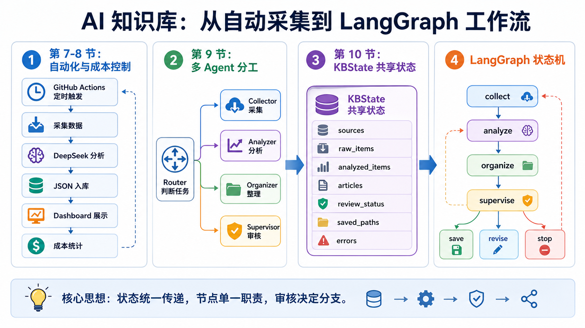

# 02｜给 AI 知识库加记忆：我不想再让信息只在当天有用

> 公众号名称：研路炼钢  
> 系列名称：从 0 到 1 搭建 AI 知识库  
> 文章编号：02  
> 配图文件名：images/02-memory-cover.png

## 封面图建议

一张知识卡片铺开的俯拍图：每张卡片上有标题、来源、标签和状态，旁边是终端窗口里的 JSON 文件列表。色调干净，体现“信息被整理成可追踪记忆”。

## 开头场景

我每天都会看到很多 AI 相关信息。

GitHub Trending 上某个 Agent 项目突然火了，公众号里有人分析一个新框架，arXiv 又出现一篇多智能体论文，群里还会有人转发模型评测和开源工具。刚看到的时候，我通常觉得很有用，甚至会打开十几个标签页。

但问题是，第二天我基本只记得“好像看过”。一周之后，只剩下一个模糊印象：有个项目挺适合做知识库，有个框架好像能降低 Agent 编排成本。真正需要写论文、做方案、搭系统的时候，我找不到原链接，也说不清它到底解决了什么问题。

这就是我想给 AI 知识库加“记忆”的原因。

这里的记忆不是聊天记录，也不是浏览器收藏夹，而是一套可以被检索、分析、复用的结构化知识条目。它要能回答：我什么时候看到它？它来自哪里？它有什么技术亮点？它和我的研究有什么关系？我当时判断它值得关注的理由是什么？

## 这节做了什么

我把知识库的核心数据形态确定为 JSON 知识条目。

每条信息不再只是一个链接，而是一个有固定字段的对象。它包含 `id`、`title`、`source`、`source_url`、`collected_at`、`summary`、`analysis`、`tags`、`audience` 和 `status`。

这些字段看起来有点像数据库设计，但对我来说，它更像是在训练自己如何认真对待信息。

`source_url` 让内容可追溯。没有来源的内容，再精彩也不能进入知识库核心区。`collected_at` 记录时间，因为 AI 技术变化太快，一条信息的价值和它出现的时间强相关。`summary` 要求用一句中文概括，逼自己把“感觉有用”翻译成明确表达。`analysis` 里放技术亮点、相关性评分和理由，帮助我区分事实和判断。`tags` 让后续检索成为可能。`status` 则标记这条知识是草稿、已审核、已发布还是归档。

我还把原始采集数据和清洗后的知识条目分开保存。`knowledge/raw` 负责保留原貌，`knowledge/articles` 负责存放整理后的版本。这样做有一个好处：如果后面分析逻辑改了，我可以回到原始数据重新处理，而不是只能相信第一次生成的结果。

## 关键产物

这一节的关键产物是一套知识条目格式。

它的意义不是“我会写 JSON”，而是我终于给信息建立了进入系统的门槛。

过去我的信息流是松散的：看到、收藏、遗忘。现在它变成了一个流程：采集、保留来源、生成摘要、打标签、评分、进入状态管理。

这种变化很小，但影响很大。因为一旦信息有了结构，它就能参与后续工作。比如我可以统计最近一周 Agent 方向最常出现的标签，可以筛选 relevance_score 高于 8 的项目，可以把 reviewed 状态的条目推送到日报，也可以从某个 topic 里提炼公众号选题。

更重要的是，结构化记忆能减少重复劳动。以前我每次写材料都要重新搜索，现在我可以先问自己的知识库：我已经看过什么？哪些是真正相关？哪些只是热闹？

## 我真正学到的

做知识库时，我最深的体会是：不要把“保存”误认为“记忆”。

保存只是把东西放在那里。记忆是信息被组织成可以再次使用的形态。浏览器收藏夹、微信收藏、临时 Markdown，都可以保存，但它们不一定能形成记忆。因为当你再次需要它时，你还要重新判断它是什么、为什么重要、能用在哪里。

结构化字段其实是在帮未来的自己节省判断成本。

我也意识到，AI 生成摘要不能直接当成事实。它可以帮助我加速整理，但必须保留来源链接，必须有状态字段，必须允许后续审核。尤其是做研究时，最危险的不是不知道，而是把一个未经验证的总结当成可靠结论。

所以我给知识条目定了红线：不编造不存在的项目、论文、数据源、评测结果或 URL。任何 AI 生成内容都要区分事实、推断和建议。这条规则看似严肃，其实很现实。因为一旦知识库里混入虚假内容，它会污染后面所有输出。

我还学到一点：好的记忆系统，不追求一开始就很智能。先让数据干净、字段稳定、来源可追踪，比急着接入复杂检索更重要。

## 给后来者的行动清单

如果你也想给自己的 AI 工具加记忆，可以从这些动作开始。

1. 为每条信息保留唯一 ID，不要只靠标题识别。
2. 强制保存来源链接和采集时间。
3. 摘要控制在一句话，训练自己抓重点。
4. 给每条信息打 2 到 5 个标签，避免标签泛滥。
5. 加一个状态字段，区分草稿、审核、发布和归档。
6. 原始数据和整理后数据分开保存，方便重跑流程。
7. AI 生成内容只作为初稿，不直接当最终事实。

如果这些都做好，你的知识库就不再是资料仓库，而会慢慢变成一个可以参与思考的外部记忆。

## 结尾金句

信息只有被结构化、可追溯、可复用，才算真正从当天的热闹变成长期的记忆。
