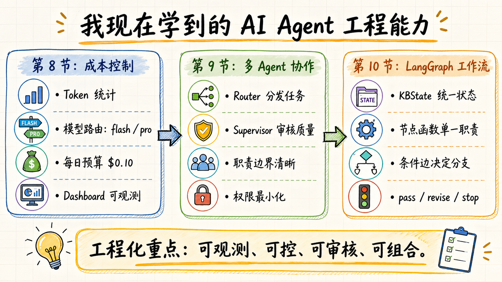

# 03｜我为什么拆 Sub-agents：一个 AI 不该同时负责所有事

> 公众号名称：研路炼钢  
> 系列名称：从 0 到 1 搭建 AI 知识库  
> 文章编号：03  
> 配图文件名：images/03-subagents-cover.png

## 封面图建议

一张简洁的流程图式封面：Collector、Analyzer、Organizer 三个节点依次连接到知识库文件夹。背景可以是终端和白板，突出“分工协作”而不是赛博感。

## 开头场景

刚开始做 AI 知识库时，我很自然地想让一个 AI 完成所有事情。

给它一个任务：去找今天 AI 领域值得关注的内容，分析一下，整理成 JSON，再输出日报。听起来很顺。实际做起来，很快就会暴露问题。

它一会儿要像爬虫一样关心标题、链接、时间和来源，一会儿要像研究助理一样判断技术价值，一会儿又要像编辑一样去重、打标签、控制格式。任务多了之后，提示词越来越长，输出越来越不稳定。一旦结果出错，我也很难判断到底是采集错了、分析偏了，还是整理阶段把字段弄乱了。

这时我才意识到，一个 AI 不该同时负责所有事。不是因为它能力不够，而是因为职责混在一起，系统就无法调试。

所以第三篇，我开始拆 Sub-agents。

## 这节做了什么

我把 AI 知识库的工作拆成三个角色：采集 Agent、分析 Agent、整理 Agent。

采集 Agent 只负责从外部来源拿候选信息。它的重点不是写得多漂亮，而是保留事实：URL、标题、来源、时间、原始描述。对它的要求是稳定、可追溯、少加工。

分析 Agent 负责判断信息价值。它要看一个项目或文章的技术亮点，判断它和 AI Agent、工作流、知识库、研究生工程实践之间的相关性，并给出理由。它可以有观点，但必须说明依据。

整理 Agent 负责把前两步的结果变成标准知识条目。它要去重、补标签、统一字段、检查状态，并把最终结果归档到 `knowledge/articles`。它更像一个严谨的编辑，不追求新观点，而追求格式干净和结构稳定。

这三个角色对应到项目规范里，不只是概念，而是明确写进了 Agent 角色概览。这样做的好处是，以后无论我用 Codex、OpenCode 还是别的编排方式，都能沿用同一套职责边界。

## 关键产物

这一节的关键产物，是一套可解释的多 Agent 分工。

它解决了三个问题。

第一，错误更容易定位。比如条目没有 `source_url`，大概率是采集阶段的问题；`relevance_score` 很奇怪，应该看分析阶段；JSON 字段缺失，则重点检查整理阶段。

第二，提示词更容易写。每个 Agent 只需要知道自己的任务边界，不必把整个系统都塞进上下文。采集 Agent 不需要理解公众号风格，整理 Agent 也不需要重新判断技术趋势。

第三，后续扩展更自然。将来我想新增一个 Reviewer Agent，专门检查事实和风险；或者新增 Publisher Agent，把 reviewed 状态的内容推送到日报，都可以沿着现有结构扩展，而不是推翻重来。

从工程角度看，Sub-agents 的核心不是“多几个 AI 更高级”，而是把职责拆到能测试、能替换、能追责的程度。

## 我真正学到的

我以前容易把 Agent 理解成一个很聪明的助手，最好什么都会。但做工程时，我越来越觉得，可靠系统不是靠一个“全能助手”撑起来的，而是靠边界清楚的普通模块协作起来的。

这和写代码很像。一个函数如果既读文件、又请求接口、又清洗数据、又写数据库，短期很方便，长期很痛苦。Agent 也是一样。一个提示词如果既要采集、分析、改写、审核、发布，它就会变成一个难以维护的黑箱。

拆分 Sub-agents 的过程，其实是在逼我回答：这个系统里有哪些稳定职责？哪些判断可以推迟？哪些输出应该成为下一个环节的输入？哪些错误需要在当前环节暴露？

我也学到，不是所有任务都需要多 Agent。任务很小、流程很短时，一个 Agent 足够。但一旦任务具有连续流程、结构化输出、质量检查和后续复用，多 Agent 就不只是形式，而是降低复杂度的手段。

还有一点很重要：Agent 分工不能只停留在名字上。叫 Collector、Analyzer、Organizer 并没有意义，关键是每个角色要有输入、输出、质量标准和不该做的事。比如采集 Agent 不该编写深度分析，分析 Agent 不该擅自补不存在的 URL，整理 Agent 不该为了字段完整而捏造信息。

这些限制让系统慢下来一点，但也让它更可信。

## 给后来者的行动清单

如果你准备在项目里使用 Sub-agents，可以先按这个顺序做。

1. 先画出完整流程，不要一上来就起 Agent 名字。
2. 找出流程里性质不同的职责，比如采集、判断、格式化、审核。
3. 为每个 Agent 写清楚输入、输出和禁止行为。
4. 让每个 Agent 的输出都能被保存和检查。
5. 出错时先定位阶段，再修改提示词或代码。
6. 不要为了“多智能体”而多智能体，只有边界复杂时才拆。

对研究生项目来说，多 Agent 的价值不在炫技，而在把复杂任务拆成自己能看懂、能复盘、能改进的步骤。

## 结尾金句

真正可靠的 Agent 系统，不是让一个 AI 变得全能，而是让每个 AI 都知道自己该负责到哪里。
