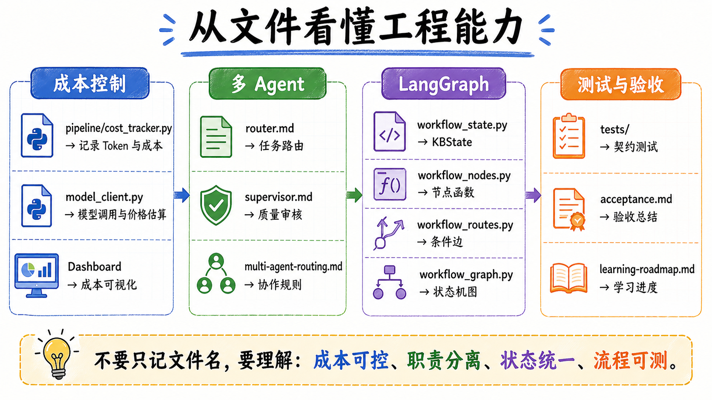

# 04｜把经验沉淀成 Skills：别让每次协作都从零解释

> 公众号名称：研路炼钢  
> 系列名称：从 0 到 1 搭建 AI 知识库  
> 文章编号：04  
> 配图文件名：images/04-skills-cover.png

## 封面图建议

一张“工具卡片墙”风格封面：GitHub Trending 采集、技术摘要、写作规范、项目终端等卡片整齐排列。重点不是堆很多工具，而是表达“把反复有效的方法沉淀成可复用流程”。

## 开头场景

我和 AI 协作时，经常遇到一个很现实的问题：同样的要求，要反复讲。

写公众号，要提醒它保持第一人称、克制真诚、具体可执行。分析论文，要提醒它关注方法、数据集、评价指标和局限。改代码，要提醒它先读项目规范，不要回退别人修改。做可视化，又要强调图表服务论文表达，不要只追求好看。

这些话讲一两次还好，讲多了就会发现：我不是在创造新内容，而是在重复交代工作习惯。

所以第四篇，我想聊 Skills。

这里的 Skills 不是简历上的技能点，而是一组可复用的协作说明。它把某类任务的流程、原则、输入输出和注意事项沉淀下来。下次遇到类似任务时，AI 不需要从零猜，也不需要我把所有规则重新打一遍。

## 这节做了什么

我在工作流里开始使用技能化思路。

比如在对话侧，我会使用写作助手类技能来辅助“研路炼钢”公众号系列。它不会直接跳到正文，而是先判断选题清不清楚。如果观点模糊，就先做思维挖掘和选题确定；如果观点已经明确，就进入框架和内容产出。

这套流程对我很有用。因为很多时候，写不出来不是文笔问题，而是选题没有站稳。技能把这个判断前置，避免 AI 拿到一个模糊主题就直接生成一篇看似完整、其实没抓住核心的文章。

在这个 AI 知识库项目内部，我真正沉淀到仓库里的 Skills 更聚焦：`github-trending` 负责定义 GitHub Trending 采集流程，`tech-summary` 负责定义技术摘要和评分流程。写作、浏览器自动化、文档润色这类能力更多来自当前 AI 助手环境，不等于都已经沉淀在本项目仓库里。

在代码协作里，Skills 也有类似作用。它会提醒助手先读本地规范，优先使用项目已有模式，编辑前说明要改什么，验证后再汇报结果。对于一个多人或多工具参与的仓库，这些习惯比单次代码能力更重要。

我把 Skills 理解为“把经验写进流程”。它不像一个具体函数那样直接产出结果，但它决定了产出结果的方式。

## 关键产物

这一节的关键产物，是我开始把重复协作规则从临时提示里抽出来。

以前我会在每次任务里写很长的要求。比如“不要太营销”“不要空泛”“要结合研究生场景”“要有行动清单”。现在这些要求可以逐步沉淀成写作风格、内容结构和质量标准。

这次公众号草稿，就是一个典型例子。用户给出了品牌名、风格、目录、结构和字数范围。写作侧技能帮我把这些要求转成稳定执行：每篇都围绕一个工程主题，有开头场景，有做了什么，有关键产物，有反思，也有行动清单。

更长远地看，Skills 可以让个人知识库具备“方法记忆”。它记住的不只是内容，还有做事方式。对这个项目来说，第一批方法记忆就是：GitHub 趋势怎么采、技术条目怎么摘要、评分理由怎么写、哪些空洞表达要避免。

当这些方法被固化下来，AI 协作会从“每次靠临场发挥”变成“在固定流程上迭代”。

## 我真正学到的

我真正学到的是：提示词不是越长越好，真正有价值的是可复用的工作协议。

临时提示很容易堆叠。今天加一句“具体一点”，明天加一句“不要浮夸”，后天再加一句“注意项目规范”。最后提示词变得很长，但里面很多内容其实是长期规则。长期规则如果一直放在临时输入里，就会增加沟通成本，也更容易遗漏。

Skills 的价值在于把这些长期规则沉淀下来，让每次协作都站在同一个起点上。

我也发现，好的 Skill 不应该只写口号。比如“写得有深度”太空，“先写场景，再写动作，再写反思，再给清单”就更可执行。工程协作也是一样，“保证质量”太空，“修改前读取 AGENTS.md，只编辑目标文件，最后汇报路径和验证结果”就更可执行。

还有一点对研究生很重要：Skills 能帮助我们形成自己的方法论。不是每次都依赖 AI 给答案，而是把自己认可的流程写下来，让 AI 按这个流程辅助执行。这样做久了，真正提高的是自己的工作系统，而不是某一次输出。

## 给后来者的行动清单

如果你想开始沉淀自己的 Skills，可以从这些地方入手。

1. 找出你经常重复交代 AI 的要求。
2. 把要求改写成流程，而不是形容词。
3. 为每类任务定义输入、步骤、输出和质量标准。
4. 保留少量风格原则，但更多写可执行动作。
5. 每次任务结束后复盘：哪些规则应该进入 Skill。
6. 不要追求一次写完，Skills 应该在真实任务中迭代。

对个人来说，Skills 最有价值的地方不是让 AI 更听话，而是让自己的经验不再散落在一次次对话里。

## 结尾金句

真正成熟的 AI 协作，不是每次把需求说得更长，而是把反复有效的方法沉淀成下一次的起点。
