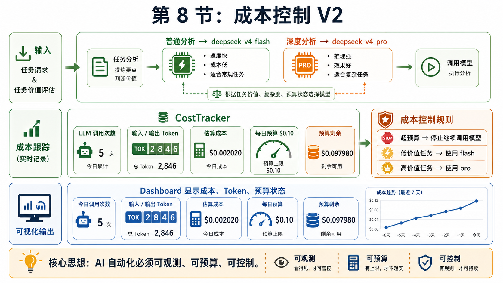

# 08｜AI 工具越用越贵之后，我开始认真做成本控制

> 公众号名称：研路炼钢  
> 系列名称：从 0 到 1 搭建 AI 知识库  
> 文章编号：08  
> 配图文件名：images/08-cost-control-cover.png

## 封面图建议

封面可以是一张「AI 成本账本」：左边是模型调用、云服务器、API Key、存储空间，右边是预算曲线和红色预警线。整体风格克制，不要做成夸张的财富焦虑。

## 开头场景

刚开始用 AI 工具时，我对成本没有太强感知。一次对话可能只是几分钱，也可能因为模型和上下文变长迅速累积；一次图片生成、一次云服务器调试，也都可能从小额支出变成长期账单。真正让我警醒的是某次连续调试工作流，模型调用、失败重试、日志分析叠在一起，最后发现花掉的钱并没有换来等比例的产出。

这件事对我影响挺大。研究生做项目，时间和钱都不是无限资源。工具能提高效率，但如果没有边界，它也会制造新的浪费。尤其是 AI 工具很容易让人产生一种错觉：只要继续问、继续试、继续生成，就离答案更近。

第八篇，我做的是给 AI 工作流建立成本控制意识。不是不用工具，而是让每一次调用都有目的、有记录、有复盘。

## 这节做了什么

我先把成本拆成三类：模型调用成本、计算资源成本和时间成本。前两类能看见账单，第三类更隐蔽，但往往更贵。比如同一个问题反复问模型十次，账单可能不高，但如果我没有沉淀规则，下次还会继续重复。

接着我给不同任务分配模型等级。不是所有任务都需要强推理模型。整理文件名、改 Markdown 格式、生成简单摘要，可以用低成本模型或本地脚本；涉及技术方案取舍、代码审查、论文理解，再使用能力更强的模型。模型选择不是面子问题，而是资源配置问题。

我还增加了调用前检查。每次准备让模型处理大段内容前，我会先问自己三个问题：输入是否已经清洗，目标是否足够明确，输出格式是否定义清楚。如果这三个问题没有答案，直接调用大概率会浪费。

在工程侧，我把可重复的任务尽量脚本化。例如统计文件、提取目录、批量重命名、格式检查，这些任务让传统脚本做更稳定。AI 更适合处理模糊、语义、判断类问题，而不是替代所有确定性操作。

最后，我开始记录关键调用。不是每次都写很详细，但重要任务会记录使用了什么模型、花了多少轮、得到什么产物、是否值得复用。这个记录让我能看清楚哪些地方真提升效率，哪些地方只是把焦虑转化成了对话轮数。

## 关键产物

第一个产物是一张成本分层表。我把任务分为低成本自动化、中成本模型辅助、高成本深度推理三层。每层对应不同工具和使用规则，避免一上来就用最贵方案。

第二个产物是 Prompt 前置检查清单。它很短：背景是否足够、目标是否具体、输入是否干净、输出格式是否明确、是否真的需要模型。每次调用前扫一遍，可以减少很多无效对话。

第三个产物是调用复盘记录。它记录的不只是费用，还有产出质量。因为真正需要优化的不是「花了多少钱」，而是「每一块钱和每一分钟换来了什么」。

## 我真正学到的

我真正学到的是，成本控制不是省钱思维，而是工程思维。

省钱思维容易走向不用工具，工程思维关注投入产出。该花的钱要花，比如复杂方案评审、关键代码排查、论文难点理解，这些场景如果模型能帮我少走弯路，成本是值得的。但如果一个任务用脚本 10 秒能完成，我却让模型来回解释五轮，那就是不成熟。

我也开始意识到，输入质量直接决定成本。很多时候不是模型不行，而是我给的问题太散。背景没说清，目标没定义，文件没整理，最后只能通过多轮追问补上下文。看似是模型在工作，其实是在替我的混乱买单。

另一个变化是，我更重视复用。一个好的 Prompt 模板、一个稳定脚本、一份清晰规范，后面可以重复使用很多次。相反，一次性的长对话如果没有沉淀，结束后就消失了。AI 时代真正的资产不是聊天记录，而是从聊天中提炼出的流程和标准。

成本控制也让我变得更克制。以前遇到问题会马上问模型，现在我会先做最小验证：查日志、读报错、缩小范围、准备输入。等问题被压缩到足够清楚，再让模型参与。这样模型给出的建议更准，我也更能判断哪些建议可用。

## 给后来者的行动清单

1. 给 AI 使用设一个月度预算，哪怕只是粗略数字，也比完全没有边界好。

2. 把任务按难度分层，不要所有问题都调用最高规格模型。

3. 调用模型前先整理输入。文件、日志、目标、限制条件越清楚，成本越低。

4. 能用脚本稳定完成的任务，优先脚本化；需要判断和抽象的任务，再交给模型。

5. 对高成本任务记录调用过程，包括模型、轮数、产物和是否可复用。

6. 建立自己的 Prompt 模板库。不要每次从空白开始写需求。

7. 对失败调用做复盘。失败不是只怪模型，也要检查输入和任务定义。

8. 每周看一次账单或使用量。成本问题越早看见，越容易调整。

## 结尾金句

真正成熟的 AI 使用方式，不是敢不敢花钱，而是知道每一次调用为什么值得。
