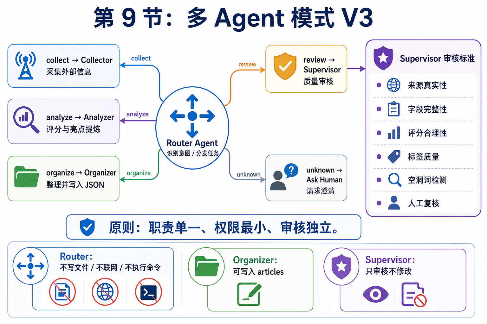

# 09｜多智能体不是开很多窗口，而是重新分配责任

> 公众号名称：研路炼钢  
> 系列名称：从 0 到 1 搭建 AI 知识库  
> 文章编号：09  
> 配图文件名：images/09-multi-agent-cover.png

## 封面图建议

封面可以设计成一个项目会议桌：Router、Collector、Analyzer、Organizer、Supervisor 五个角色围绕同一块任务板协作，桌面上有数据源、JSON 条目、评分报告和审核清单。

## 开头场景

我第一次尝试多智能体协作时，做法其实很粗糙：开几个对话窗口，一个负责写代码，一个负责解释论文，一个负责改文档。看起来像是团队协作，实际很快变成信息混乱。

最大的问题不是智能体不够多，而是责任没有说清楚。每个窗口都能给建议，但没有谁对最终结果负责；每个角色都能输出内容，但上下文不一致，口径也不统一。最后我反而要花更多时间做整合。

第九篇，我重新理解了多智能体：它不是把同一个问题问给很多模型，而是把一个复杂任务拆成不同责任边界。角色越多，越需要规则；协作越复杂，越需要产物交接。

## 这节做了什么

我先把这个知识库项目里的角色对齐到真实工作流：`collector` 负责采集外部信息，`analyzer` 负责分析和打分，`organizer` 负责整理并写入标准 JSON，`router` 负责识别任务类型并分发，`supervisor` 负责质量审核。

这个划分听起来简单，但对我帮助很大。以前我会让一个模型同时完成采集、分析、整理、检查和总结，结果输出经常又长又散。现在我会明确告诉它当前只承担一个角色。比如 `supervisor` 不需要重写全部文章，它只需要指出风险、证据和建议。

接着我设计了交接格式。每个角色输出时必须包含「已完成内容」「证据位置」「风险」「下一步」。这样下一个角色不需要重新猜上下文。多智能体协作最怕的就是每一轮都从头解释，交接格式就是降低沟通成本的工具。

我还加入了一个重要规则：同一阶段只能有一个主责角色。比如采集阶段由 `collector` 主责，分析阶段由 `analyzer` 主责，整理阶段由 `organizer` 主责，审核阶段由 `supervisor` 主责。其他角色可以提供建议，但不能抢主线。否则协作会变成多个声音同时指挥一个项目。

最后，我把多智能体用在实际场景里：用户说“采集”时路由到 `collector`，说“分析”时路由到 `analyzer`，说“整理保存”时路由到 `organizer`，说“审核质量”时路由到 `supervisor`。每个场景都不追求复杂系统，而是先跑通“识别意图、交给主责角色、输出结构化结果、再由审核把关”这个闭环。

## 关键产物

第一个产物是角色卡片。每张卡片写清楚角色目标、输入材料、输出格式和禁止事项。比如 `router` 不能写文件也不能联网，`collector` 可以访问外部网页但不能落盘，`organizer` 可以写入文章文件但不能再引入新来源，`supervisor` 只审核不修改。

第二个产物是交接模板。它包括任务背景、当前状态、完成项、未完成项、风险点和下一步。这个模板让不同智能体之间的上下文传递更稳定。

第三个产物是契约测试。它检查 `router.md` 和 `supervisor.md` 是否存在、权限是否正确、路由文档是否包含关键映射、质量问题关键词是否覆盖。这样角色定义不是写完就算，而是进入测试保护。

## 我真正学到的

我真正学到的是，多智能体的核心不是数量，而是责任设计。

一个人做项目时，脑子里其实也有多个角色：有时候我是研究者，有时候是程序员，有时候是审稿人，有时候是项目经理。AI 多智能体只是把这些角色显性化。显性化以后，问题也会暴露出来：我有没有真的定义任务？有没有检查标准？有没有记录决策？

我也发现，多智能体特别适合处理我容易偷懒的环节。比如审查。自己写完代码后，很容易只验证能跑就结束。但如果单独设置一个审查者角色，它会逼我面对边界情况、错误处理、测试缺口。它不一定比我聪明，但它比我更稳定地执行检查动作。

不过，多智能体也不是越复杂越好。角色太多会增加协调成本，尤其是个人项目。如果一个任务本来 30 分钟能完成，却设计了 6 个角色来回交接，那就是形式大于价值。我的原则是：只有当任务存在明显的责任冲突时，才拆角色。比如「想快速实现」和「需要严格审查」就是冲突，值得拆开。

还有一个收获是，最终决策权必须在人这里。智能体可以建议，可以质疑，可以整理，但不能替我承担研究判断。尤其是论文方向、实验取舍、成本投入这些问题，需要结合真实约束。AI 可以扩展视角，不能代替负责人。

## 给后来者的行动清单

1. 不要一开始就追求复杂多智能体系统，先定义 3 到 4 个高频角色。

2. 每个角色只做一类事。规划者不要顺手写代码，审查者不要顺手重构全部内容。

3. 给角色写清楚禁止事项，边界比能力描述更重要。

4. 固定交接格式，让下一个角色能直接接上任务。

5. 所有建议都要有证据。代码审查要指向文件，论文分析要指向段落或实验表。

6. 保留人工最终决策。尤其是涉及方向、成本和风险的地方。

7. 小任务不要拆太细。多智能体是为复杂度服务，不是为了制造仪式感。

8. 定期复盘角色是否有用。没有稳定产出的角色，就合并或删除。

## 结尾金句

多智能体真正解决的不是人手不够，而是复杂任务里责任不清。
