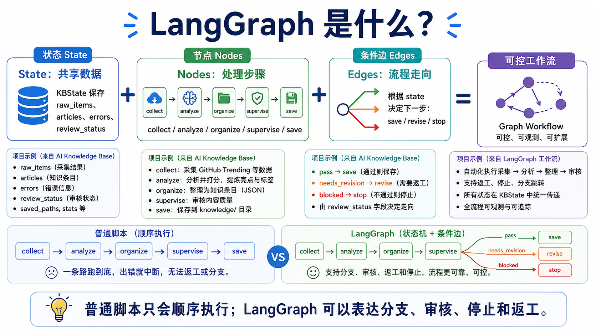
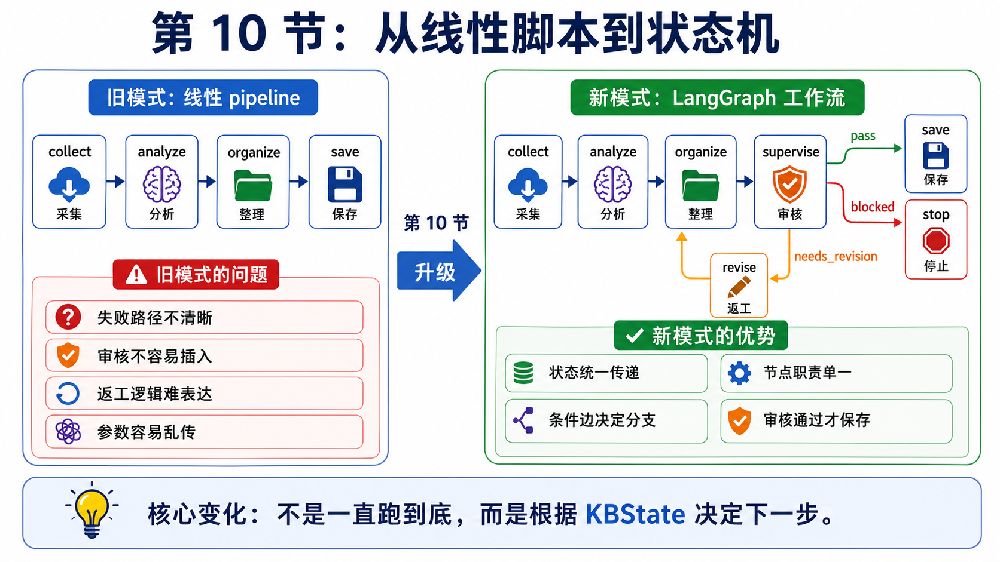
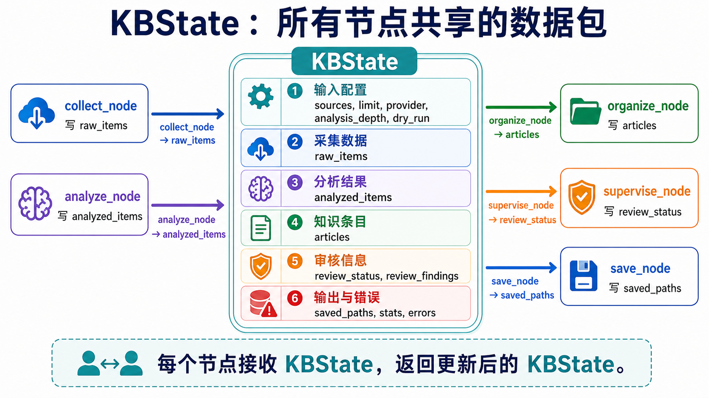
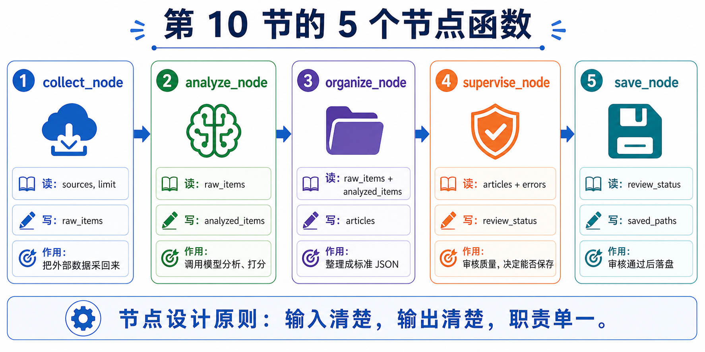
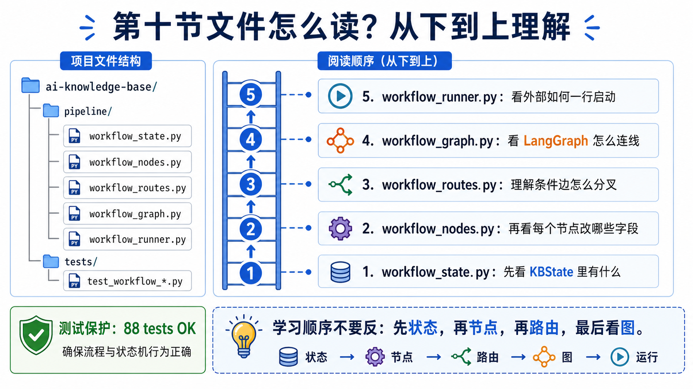
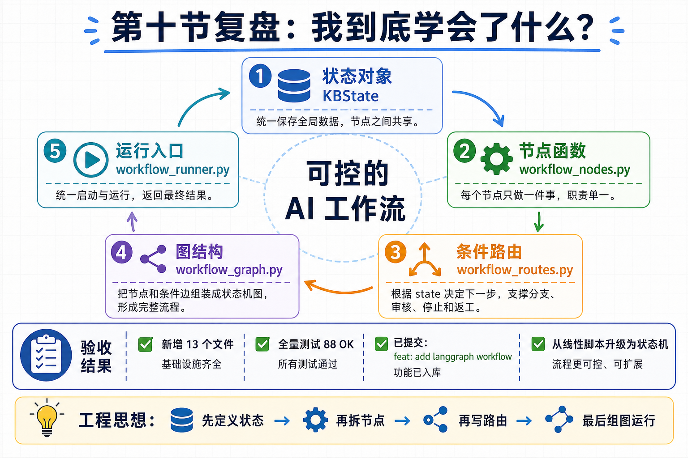

# 10｜用 LangGraph 理解工作流：让 AI 从对话走向状态机

> 公众号名称：研路炼钢  
> 系列名称：从 0 到 1 搭建 AI 知识库  
> 文章编号：10  
> 配图文件名：images/10-langgraph-cover.png

## 封面图建议

封面可以是一张「AI 状态机蓝图」：节点包括 collect、analyze、organize、supervise、save，节点之间用有方向的线连接，旁边放一台运行中的工程终端。重点突出 `KBState` 在节点之间流动。

## 开头场景

在连续做了几篇 AI 工具链复盘之后，我越来越明显地感到：单轮对话解决不了持续任务。它适合回答一个问题、生成一段内容、解释一段代码，但不适合管理一个会反复判断、失败重试、人工确认的流程。

比如做 AI 知识库时，系统可能先采集 GitHub 项目，发现没有数据就不该继续浪费模型调用；生成分析结果后要整理成标准 JSON；整理完成后还要经过 Supervisor 审核，审核通过才保存。这不是一条直线，而是带有状态和分支的流程。

第十篇，我开始用 LangGraph 的思路理解 AI 工作流。重点不是追逐框架名词，而是学习一种工程表达：把 AI 任务从「聊天」变成「有状态的图」。

## 这节做了什么

我先把知识库任务画成图。节点包括 `collect`、`analyze`、`organize`、`supervise`、`save`。每个节点只负责一件事，节点之间通过 `KBState` 传递信息。

然后我定义了状态字段。比如 `sources`、`raw_items`、`analyzed_items`、`articles`、`review_status`、`review_findings`、`saved_paths`、`stats`、`errors`。状态字段的意义是让流程知道自己已经掌握了什么，还缺什么。没有状态，系统只能靠上下文猜；有了状态，流程就可以检查和分支。

接着我设计了条件边。比如 `collect` 后如果有数据就进入 `analyze`，如果没有数据或出现错误就进入 `supervise`；`analyze` 后如果有结果就进入 `organize`，否则也进入 `supervise`；`supervise` 后如果 `review_status=pass` 就进入 `save`，如果是 `needs_revision` 或 `blocked` 就结束。这让我意识到，很多 AI 应用的难点不是生成文本，而是处理「什么时候继续、什么时候停止」。

这一节没有真正实现人工确认节点。它完成的是最小可运行的 LangGraph 工作流：状态、节点、条件边、图构建和 `run_workflow()` 入口。人工确认、自动返工和 HumanFlag 是下一节要继续做的能力。这个边界必须说清楚，否则很容易把“设计方向”误写成“已经实现”。

最后，我把这套图结构落到了代码里：`workflow_state.py` 定义状态，`workflow_nodes.py` 定义节点，`workflow_routes.py` 定义条件跳转，`workflow_graph.py` 组装 LangGraph，`workflow_runner.py` 提供运行入口。这样它不只是文档设计，而是已经有最小实现和测试保护。

## 关键产物

第一个产物是一张工作流图。它明确了任务从输入到输出经过哪些节点，每个节点的职责是什么，失败时进入哪里。

第二个产物是状态字段表。它记录流程运行中需要保存的信息，包括原始输入、中间分析、整理后的文章、审核状态、错误和最终产物路径。

第三个产物是条件分支规则。它把过去凭感觉处理的情况写成明确判断：采集无数据就审核，分析无结果就审核，审核通过才保存，审核不通过就结束等待处理。

第四个产物是运行入口和测试。`run_workflow()` 让外部只需要一行调用就能启动状态机；88 个测试则保护状态、节点、路由、图构建和运行入口不会被后续改坏。

## 我真正学到的

我真正学到的是，AI 工程的很多问题，本质上是流程控制问题。

以前我更关注模型能不能生成好答案。现在我会继续追问：答案生成后谁检查？检查不通过怎么办？上下文丢失怎么办？工具调用失败怎么办？人什么时候介入？这些问题如果不设计，系统就只能停留在演示级别。

LangGraph 给我的启发是，把不确定性显性化。研究任务里充满不确定性：材料可能不完整，模型可能理解偏，实验可能失败，需求可能变化。好的工作流不是假设一切顺利，而是提前设计失败路径。

我也意识到，状态比对话历史更可靠。对话历史很长，但里面有很多噪声；状态字段更短，却保留了流程真正需要的信息。比如 `raw_items` 是否为空、`errors` 是否存在、`review_status` 是否为 `pass`，这些状态能直接驱动下一步。

另一个收获是，图结构能帮助我和自己沟通。很多时候我以为自己想清楚了，真正画成节点和边，才发现某些步骤没有输入，某些判断没有标准，某些失败没有出口。图不是为了好看，而是为了暴露流程漏洞。

对研究生成长来说，这个思维也很重要。论文、实验、工程、汇报，本来就是多个状态不断切换的过程。把它们设计成可追踪流程，可以减少很多无效焦虑。你知道现在在哪个节点，缺什么材料，下一步该找谁确认，事情就不再是一团雾。

## 给后来者的行动清单

1. 选一个你经常重复的 AI 任务，把它画成节点图，不要直接写代码。

2. 每个节点只定义一个职责，避免一个节点同时做检索、推理、写作和审查。

3. 列出状态字段，明确流程需要记住哪些信息。

4. 为失败情况设计返回路径。不要只设计成功路径。

5. 把人工确认点先标出来，等系统进入自主规划阶段再实现，不要把未实现能力写成已落地功能。

6. 条件分支要具体，例如「指标为空」「测试失败」「人工审查不通过」，不要写成模糊的「效果不好」。

7. 先用文档模拟一遍流程，再用 LangGraph 做最小实现，最后用测试保护节点和路由。

8. 每次流程跑完后复盘节点是否合理。节点设计会随着任务理解不断变化。

## 结尾金句

当 AI 从对话变成状态机，工具才真正开始承担长期任务。
